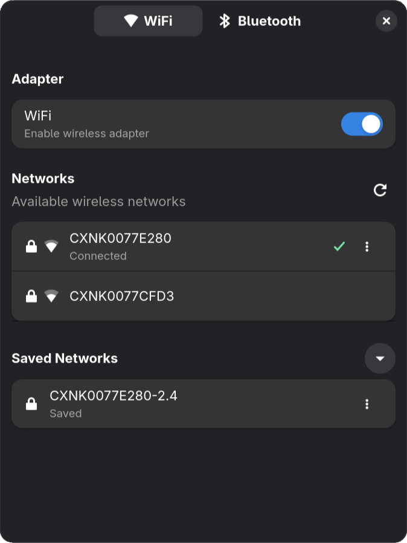

# wlcontrol

WiFi and Bluetooth control app for Linux, built with GTK4/libadwaita.

Uses [IWD](https://iwd.wiki.kernel.org/) for WiFi and [BlueZ](http://www.bluez.org/) for Bluetooth.

This is a "scratch my own itch" project. I got tired of CLI tools for managing wireless connections and just wanted a nice-looking GUI where I can simply click around with my mouse.



## Installation

### Arch Linux (AUR)

```bash
yay -S wlcontrol
```

or for the latest git version:

```bash
yay -S wlcontrol-git
```

## Building

### Build dependencies in Ubuntu / Debian

```bash
sudo apt install pkg-config libdbus-1-dev libgdk-pixbuf-2.0-dev libgtk-4-dev libadwaita-1-dev blueprint-compiler
```

## Build

```bash
cargo build
```

Blueprint files (`.blp`) are compiled to GTK UI files automatically during `cargo build`.

## Run

```bash
cargo run
```

Enable debug logging:

```bash
RUST_LOG=debug cargo run
```
